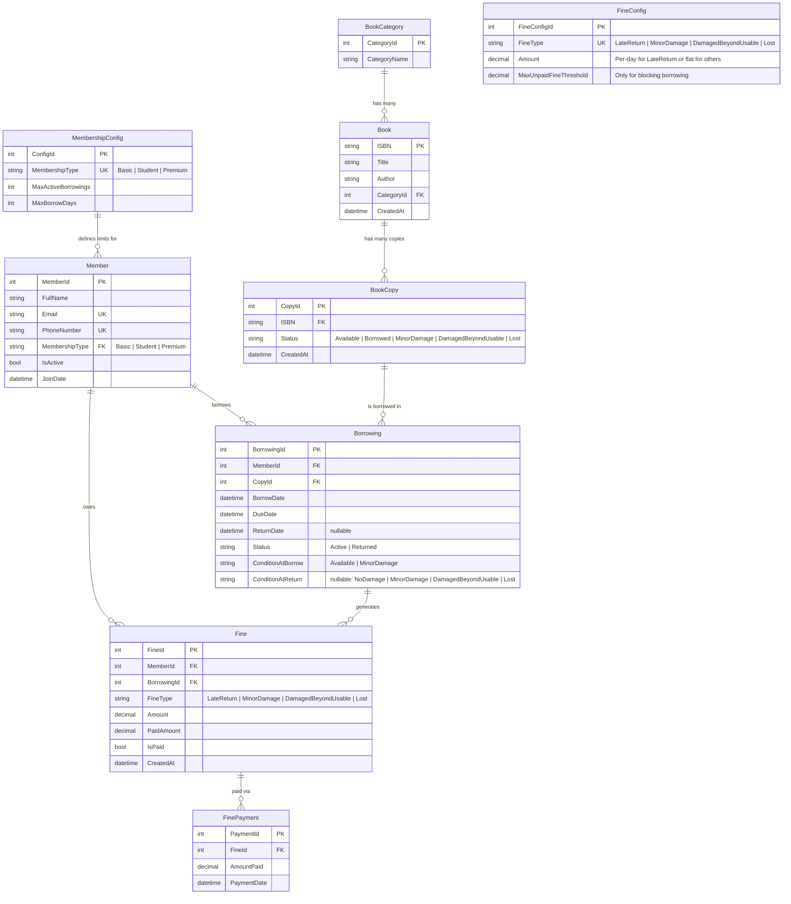

# ER Diagram — Library System

## Entity Relationship Diagram

---

## Entity Summary Table

| Entity | PK | Description |
|---|---|---|
| `BookCategory` | `CategoryId` (int, auto) | Lookup table for book genres/categories. |
| `Book` | `ISBN` (string) | Represents a book title. One ISBN = one book title. |
| `BookCopy` | `CopyId` (int, auto) | A physical copy of a book. Multiple copies per ISBN. |
| `Member` | `MemberId` (int, auto) | A library member with a membership type. |
| `MembershipConfig` | `ConfigId` (int, auto) | Config table storing borrowing limits per membership type. |
| `Borrowing` | `BorrowingId` (int, auto) | A single borrowing transaction linking a Member to a BookCopy. |
| `Fine` | `FineId` (int, auto) | A fine record generated from a borrowing (late, damage, or lost). |
| `FinePayment` | `PaymentId` (int, auto) | Individual payment against a Fine. Supports partial payments. |
| `FineConfig` | `FineConfigId` (int, auto) | Config table storing fine amounts by type. Future-proof. |

---

## Relationships

| Relationship | Type | Description |
|---|---|---|
| `BookCategory` → `Book` | One-to-Many | Each category contains many books. |
| `Book` → `BookCopy` | One-to-Many | Each ISBN has multiple physical copies. |
| `Member` → `Borrowing` | One-to-Many | A member can have many borrowings over time. |
| `BookCopy` → `Borrowing` | One-to-Many | A copy can be borrowed multiple times (sequentially). |
| `Borrowing` → `Fine` | One-to-Many | A single borrowing can generate multiple fines (e.g., late + damage). |
| `Fine` → `FinePayment` | One-to-Many | A fine can be paid in multiple installments. |
| `MembershipConfig` → `Member` | One-to-Many | Config defines limits for all members of that type. |
