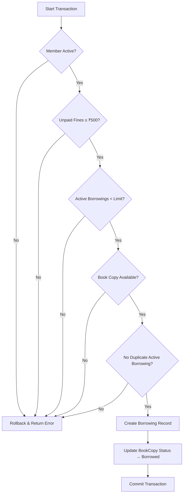

# Transaction Flow

## App FLow :

```
[PresentationLayer] (Console App)
       │
       ▼
[BusinessLogicLayer] (Class Library)
       │
       ▼
[DataAccessLayer] (Class Library) ──► PostgreSQL
```

## Transaction :

