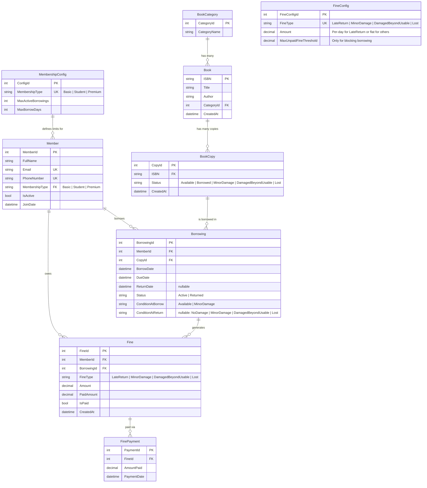
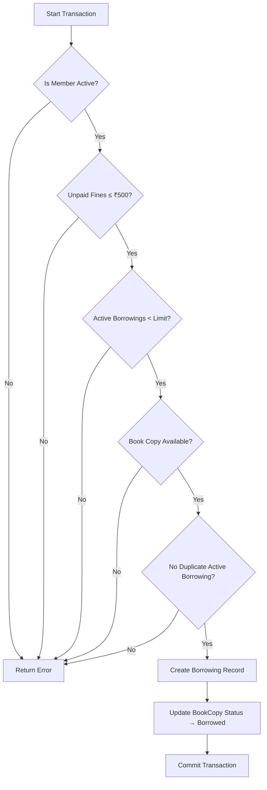

# Library System

## Technical  Requirements

- **C# / .NET 10** for the application runtime.
- **Entity Framework Core (EF Core)** using Code-First migrations.
- **PostgreSQL** as the relational database engine.

---

## UI/UX Approach

### The Challenge: Automated vs. Managed Workflows

Initially, I planned on building two separate interfaces: a user panel and an admin panel. But then I hit a major roadblock: how do we handle the handoff between the user-facing features and the admin-facing feature? We cannot reliably depend on users to self-report the condition of a book upon return. And the biggest thing I've learned from Gayathri is, always plan for scalability.  So I threw the idea of user and admin panel away.

### The Solution: Going back to the basics

So, I took a step back and looked at how traditional libraries actually work.  In the real world
- you grab the book you want off the shelf
- walk up to the front desk
- hand over your membership card
- the receptionist handles the rest. 

**That’s exactly the path I decided to take for this UI.** This library system is exclusively an Admin/Receptionist-facing interface.

```
[ User Picks Book ]  ──► [ Proceeds to Desk ]  ──► [ Admin Scans ID & Book ]  ──► [ System Logs Transaction Details ]
```


> **TLDR**
>
> - Initially the idea of separating the user and admin panel was in my mind. However, the problem of seperating the user front and admin front function arrised. 
> - Plus, for tracking the condition of the books we can't really rely on user correclty and truthfully entering the condition of the book when returned. 
> - Now tracking this condition of returned book to calculate fine by letting the user return the book but then the admin having to update the condition of said book became a big slop. 
>
> - So I treid thinking in the direction of traditional library mechanism and system that's already in place. This lead me down the path that in most of the traditonal libraries, we pick the book that we want and go to the receptionist for issuing. By providing our membership card or number, we then issue the said book. So a similar UI path has been taken by me in this project.
> 
> - This assuems the customer goes in the library, picks the book he want and then issues the said book at the reception. This library system is made by keeping the receptionist in mind, and letting the said admin have an easy time performing all the necessary actions.

---


## System Architecture

The application strictly follows a **3-Tier Architecture** solution structure:

```
[PresentationLayer] (Console App)
       │
       ▼
[BusinessLogicLayer] (Class Library)
       │
       ▼
[DataAccessLayer] (Class Library) ──► PostgreSQL
```

1.  **[DataAccessLayer] (Data Tier)**: Configures all table mappings, entity models, constraints, seed configurations, and manages the database connection using EF Core.
2.  **[BusinessLogicLayer] (Logic Tier)**: Executes core business rules, wraps database modifications in atomic transactions, calculates fines, and handles reporting logic.
3.  **[PresentationLayer] (UI Tier)**: An interactive, modular console interface containing distinct sub-menus for books, members, borrowing, returns, fines, and report generation.


---

## Database Schema Design

### 1. `book_categories`

| Column | Type | Constraints | Notes |
|---|---|---|---|
| `category_id` | `SERIAL` | PK | Auto-increment category ID |
| `category_name` | `VARCHAR(100)` | NOT NULL, UNIQUE | e.g., "Fiction", "Science", "History" |

### 2. `books`

| Column | Type | Constraints | Notes |
|---|---|---|---|
| `isbn` | `VARCHAR(20)` | PK | ISBN serves as the natural primary key |
| `title` | `VARCHAR(250)` | NOT NULL | Title of the book |
| `author` | `VARCHAR(200)` | NOT NULL | Author of the book |
| `category_id` | `INT` | FK → `book_categories`, NOT NULL | Relates to Category ID |
| `created_at` | `TIMESTAMP` | NOT NULL, DEFAULT NOW() | Date record was created |

*   **Indexes**: `idx_books_title` on `title`, `idx_books_author` on `author`.

### 3. `book_copies`

| Column | Type | Constraints | Notes |
|---|---|---|---|
| `copy_id` | `SERIAL` | PK | Unique physical copy key |
| `isbn` | `VARCHAR(20)` | FK → `books`, NOT NULL | Relates to book ISBN |
| `status` | `VARCHAR(30)` | NOT NULL, DEFAULT 'Available' | Current status of the physical copy |
| `created_at` | `TIMESTAMP` | NOT NULL, DEFAULT NOW() | Added timestamp |

*   **Check Constraint**: `chk_book_copy_status` checks `status IN ('Available', 'Borrowed', 'MinorDamage', 'DamagedBeyondUsable', 'Lost')`

### 4. `members`

| Column | Type | Constraints | Notes |
|---|---|---|---|
| `member_id` | `SERIAL` | PK | Auto-increment member ID |
| `full_name` | `VARCHAR(200)` | NOT NULL | Name of the member |
| `email` | `VARCHAR(200)` | NOT NULL, UNIQUE | Searchable primary email |
| `phone_number` | `VARCHAR(20)` | NOT NULL, UNIQUE | Searchable primary phone number |
| `membership_type` | `VARCHAR(20)` | NOT NULL, FK → `membership_config` | Link to borrowing limits |
| `is_active` | `BOOLEAN` | NOT NULL, DEFAULT TRUE | Active status flag |
| `join_date` | `TIMESTAMP` | NOT NULL, DEFAULT NOW() | Joint date timestamp |

*   **Indexes**: `idx_members_email` on `email`, `idx_members_phone` on `phone_number`.

### 5. `membership_config`

| Column | Type | Constraints | Notes |
|---|---|---|---|
| `config_id` | `SERIAL` | PK | Unique configurations key |
| `membership_type` | `VARCHAR(20)` | NOT NULL, UNIQUE | Links to membership type |
| `max_active_borrowings` | `INT` | NOT NULL | Maximum active borrowing limit |
| `max_borrow_days` | `INT` | NOT NULL | Limit on checkout duration |

### 6. `borrowings`

| Column | Type | Constraints | Notes |
|---|---|---|---|
| `borrowing_id` | `SERIAL` | PK | Check-out transaction key |
| `member_id` | `INT` | FK → `members`, NOT NULL | Link to borrowing member |
| `copy_id` | `INT` | FK → `book_copies`, NOT NULL | Link to physical copy |
| `borrow_date` | `TIMESTAMP` | NOT NULL, DEFAULT NOW() | Borrowing timestamp |
| `due_date` | `TIMESTAMP` | NOT NULL | Checked-out due date limit |
| `return_date` | `TIMESTAMP` | NULLABLE | Return timestamp |
| `status` | `VARCHAR(20)` | NOT NULL, DEFAULT 'Active' | Active/Returned loan status |
| `condition_at_borrow` | `VARCHAR(30)` | NOT NULL | Condition on check-out |
| `condition_at_return` | `VARCHAR(30)` | NULLABLE | Condition assessed on check-in |

### 7. `fines`

| Column | Type | Constraints | Notes |
|---|---|---|---|
| `fine_id` | `SERIAL` | PK | Unique fine ID |
| `member_id` | `INT` | FK → `members`, NOT NULL | Member who owes the fine |
| `borrowing_id` | `INT` | FK → `borrowings`, NOT NULL | Borrowing transaction context |
| `fine_type` | `VARCHAR(30)` | NOT NULL | Fine type category |
| `amount` | `DECIMAL(10,2)` | NOT NULL | Fine total amount |
| `paid_amount` | `DECIMAL(10,2)` | NOT NULL, DEFAULT 0.00 | Paid total balance |
| `is_paid` | `BOOLEAN` | NOT NULL, DEFAULT FALSE | Paid flag |
| `created_at` | `TIMESTAMP` | NOT NULL, DEFAULT NOW() | Fine generation timestamp |

### 8. `fine_payments`

| Column | Type | Constraints | Notes |
|---|---|---|---|
| `payment_id` | `SERIAL` | PK | Unique payment receipt ID |
| `fine_id` | `INT` | FK → `fines`, NOT NULL | Fine record ID context |
| `amount_paid` | `DECIMAL(10,2)` | NOT NULL | Payment amount |
| `payment_date` | `TIMESTAMP` | NOT NULL, DEFAULT NOW() | Receipt date |

### 9. `fine_config`

| Column | Type | Constraints | Notes |
|---|---|---|---|
| `fine_config_id` | `SERIAL` | PK | Unique configs key |
| `fine_type` | `VARCHAR(30)` | NOT NULL, UNIQUE | Fine type category context |
| `amount` | `DECIMAL(10,2)` | NOT NULL | Default fee amount rate |
| `max_unpaid_fine_threshold` | `DECIMAL(10,2)` | NULLABLE | Limit before borrow block |

---

### Entity Summary Table

| Entity | PK | Description |
|---|---|---|
| `BookCategory` | `CategoryId` (int, auto) | Lookup table for book genres/categories. |
| `Book` | `ISBN` (string) | Represents a book title. One ISBN = one book title. |
| `BookCopy` | `CopyId` (int, auto) | A physical copy of a book. Multiple copies per ISBN. |
| `Member` | `MemberId` (int, auto) | A library member with a membership type. |
| `MembershipConfig` | `ConfigId` (int, auto) | Config table storing borrowing limits per membership type. |
| `Borrowing` | `BorrowingId` (int, auto) | A single borrowing transaction linking a Member to a BookCopy. |
| `Fine` | `FineId` (int, auto) | A fine record generated from a borrowing (late, damage, or lost). |
| `FinePayment` | `PaymentId` (int, auto) | Individual payment against a Fine. Supports partial payments. |
| `FineConfig` | `FineConfigId` (int, auto) | Config table storing fine amounts by type. Future-proof. |

---

### Relationships

| Relationship | Type | Description |
|---|---|---|
| `BookCategory` → `Book` | One-to-Many | Each category contains many books. |
| `Book` → `BookCopy` | One-to-Many | Each ISBN has multiple physical copies. |
| `Member` → `Borrowing` | One-to-Many | A member can have many borrowings over time. |
| `BookCopy` → `Borrowing` | One-to-Many | A copy can be borrowed multiple times (sequentially). |
| `Borrowing` → `Fine` | One-to-Many | A single borrowing can generate multiple fines (e.g., late + damage). |
| `Fine` → `FinePayment` | One-to-Many | A fine can be paid in multiple installments. |
| `MembershipConfig` → `Member` | One-to-Many | Config defines limits for all members of that type. |

---

### Entity Relationship Diagram



---

## Business Rules

### 1. Membership Rules

#### 1.1 Membership Types
All limits for memberships are stored in a **database configuration table** (`MembershipConfig`) and are **not hardcoded** in the application to ensure the system is as **future-proof** as possible.

| Membership Type | Max Active Borrowings | Max Borrow Days |
|---|---|---|
| **Basic** | 2 | 7 |
| **Student** | 3 | 10 |
| **Premium** | 5 | 15 |

*   **Why a config table?** To Future proof the system. Incase we add a new tier or change the limits, a quick update to the DB is all thats required.

#### 1.2 Membership Status
*   A member can be either **Active** or **Inactive**.
*   Only **Active** members are allowed to borrow books.
*   Deactivating a member does **not** erase their borrowing history or pending fines; it only prevents new borrowings.

#### 1.3 Member Identification
*   Each member has a unique **MemberId** (auto-generated integer).
*   Members are searched by **Phone Number** or **Email**, both of which are strictly unique.

---

### 2. Book & Book Copy Rules

#### 2.1 Book Identification — ISBN
*   Every book title is uniquely identified by its **ISBN** (International Standard Book Number).
*   The `ISBN` field serves as the **Primary Key** of the `Book` table.
*   A single ISBN can have **multiple physical copies** tracked in the `BookCopy` table.

#### 2.2 Book Categories
*   Each book belongs to exactly **one category** (e.g., Fiction, Science, History).
*   Categories are stored in the `BookCategory` table.

#### 2.3 Book Copy Status
A book copy can be in one of the following statuses:

| Status | Meaning |
|---|---|
| `Available` | The copy is on the shelf and can be borrowed. |
| `Borrowed` | The copy is currently lent out to a member. |
| `MinorDamage` | The copy has minor damage but is still usable and can be borrowed. |
| `DamagedBeyondUsable` | The copy is severely damaged and **cannot** be borrowed. |
| `Lost` | The copy has been reported lost by a member. |

---

### 3. Borrowing Rules

#### 3.1 Pre-Borrowing Validation (All Must Pass)
Before a member can borrow a book copy, the system checks **all** of the following conditions. If **any** condition fails, the borrowing is **rejected** and the transaction is **rolled back**.

| # | Validation | Failure Message |
|---|---|---|
| 1 | Member exists and is **Active** | "Member not found or is inactive." |
| 2 | Member's total unpaid fines ≤ ₹500 | "Cannot borrow. Unpaid fines exceed ₹500." |
| 3 | Member's active borrowings < their membership limit | "Borrowing limit reached for your membership type." |
| 4 | The requested book copy status is `Available` or `MinorDamage` | "This book copy is not available for borrowing." |
| 5 | Member does **not** already have an active (unreturned) borrowing for the **same ISBN** | "You already have an active borrowing for this book." |

#### 3.2 Borrowing Transaction Steps
The entire borrowing process runs inside a **single database transaction**:
1.  Validate member (active status).
2.  Validate unpaid fines (≤ ₹500).
3.  Check active borrowing count against membership limit.
4.  Check book copy availability.
5.  Check for duplicate active borrowing of the same ISBN.
6.  Create a new `Borrowing` record with `BorrowDate = today` and `DueDate = today + MaxBorrowDays`.
7.  Update the book copy status to `Borrowed`.
8.  **Commit** the transaction.

If **any step fails**, the entire transaction is **rolled back** — no partial data is saved.

#### 3.3 Due Date Calculation
*   `DueDate = BorrowDate + MaxBorrowDays` (based on the member's membership type config).
*   *Example:* A Student borrows on Jan 1 → Due Date = Jan 11 (10 days).

---

### 4. Return Rules

#### 4.1 Return Process
When a member returns a book:
1.  Find the active borrowing record for the member + book copy.
2.  Set `ReturnDate = today`.
3.  Mark the borrowing status as `Returned`.
4.  Calculate any **late return fine**.
5.  Assess **damage** and apply necessary damage fines.
6.  Update the book copy status accordingly.

#### 4.2 Damage Assessment on Return
The librarian selects one of three options when accepting a return:

| Option | Action |
|---|---|
| **No Damage** | Book copy status → `Available`. No damage fine. |
| **Minor Damage** | Book copy status → `MinorDamage`. A flat fine is charged **only if** the copy was `Available` (good condition) when it was borrowed. If it was already `MinorDamage` when borrowed, **no damage fine** is charged. |
| **Damaged Beyond Usable** | Book copy status → `DamagedBeyondUsable`. A higher flat fine is charged **only if** the copy was `Available` or `MinorDamage` when borrowed. The copy is **retired** from lending. |

> **The "Already Damaged" Rule:**
> If a member borrows a copy that was already in `MinorDamage` status and returns it in the same condition, they are **not** fined for damage. The system tracks the condition of the copy **at the time of borrowing** (`ConditionAtBorrow`) to make this comparison.

#### 4.3 Lost Book
*   If a member reports a book as lost, the book copy status is set to `Lost`.
*   A **lost book fine** is charged (the highest fine category).
*   The borrowing is marked as `Returned` with a note indicating the book was lost.

---

### 5. Fine Rules

#### 5.1 Fine Types & Amounts
Fine amounts are stored in the **database configuration** for future-proofing:

| Fine Type | Default Amount | Trigger |
|---|---|---|
| **Late Return** | ₹10 per day overdue | `ReturnDate > DueDate` |
| **Minor Damage** | Flat fine (₹200) | Copy returned with minor damage when it was borrowed in good condition |
| **Damaged Beyond Usable** | Higher flat fine (₹500) | Copy returned severely damaged |
| **Lost Book** | Highest fine (₹1000) | Member reports the book as lost |

#### 5.2 Fine Blocking Rule
*   A member **cannot borrow** any new books if their total **unpaid fines exceed ₹500** (this threshold is read dynamically from `FineConfig`).

#### 5.3 Fine Payment
*   A member can pay their fines (full or partial payment).
*   Each payment is recorded in the `FinePayment` table with a timestamp.
*   A fine is considered **paid** when its remaining balance reaches ₹0.

---

## Transaction Flow

---


## ⚡ Stored Functions (PostgreSQL Functions)

Please click here to go to the file containing all the functions  --> [Functions](DataAccessLayer/PostgresFunctions.sql)

Please click here to view the migration files -->  [Migration Folder](DataAccessLayer/Migrations)

The system automatically loads the following functions programmatically during startup:

### 1. `calculate_member_fine(p_member_id INT)`
calculate the total unpaid balance of outstanding fines for a given member.
```sql
CREATE OR REPLACE FUNCTION calculate_member_fine(p_member_id INT)
RETURNS DECIMAL AS $$
BEGIN
    RETURN COALESCE(
        (SELECT SUM(amount - paid_amount)
         FROM fines
         WHERE member_id = p_member_id AND is_paid = FALSE),
        0
    );
END;
$$ LANGUAGE plpgsql;
```

### 2. `get_available_books_by_category(p_category_id INT)`
Returns details of available copies (either `Available` or `MinorDamage`) under a specific category.
```sql
CREATE OR REPLACE FUNCTION get_available_books_by_category(p_category_id INT)
RETURNS TABLE(isbn VARCHAR, title VARCHAR, author VARCHAR, copy_id INT, status VARCHAR) AS $$
BEGIN
    RETURN QUERY
    SELECT b.isbn, b.title, b.author, bc.copy_id, bc.status
    FROM books b
    INNER JOIN book_copies bc ON b.isbn = bc.isbn
    WHERE b.category_id = p_category_id
      AND bc.status IN ('Available', 'MinorDamage');
END;
$$ LANGUAGE plpgsql;
```

### 3. `get_member_borrowing_summary(p_member_id INT)`
Returns active borrow count, total successfully returned checkouts, and unpaid balances.
```sql
CREATE OR REPLACE FUNCTION get_member_borrowing_summary(p_member_id INT)
RETURNS TABLE(
    active_borrowings BIGINT,
    returned_borrowings BIGINT,
    total_unpaid_fine DECIMAL
) AS $$
BEGIN
    RETURN QUERY
    SELECT
        (SELECT COUNT(*) FROM borrowings WHERE member_id = p_member_id AND status = 'Active'),
        (SELECT COUNT(*) FROM borrowings WHERE member_id = p_member_id AND status = 'Returned'),
        COALESCE(
            (SELECT SUM(amount - paid_amount) FROM fines WHERE member_id = p_member_id AND is_paid = FALSE),
            0
        );
END;
$$ LANGUAGE plpgsql;
```

---

## Output


### 1. Main Menu
The entry point of the application.

```text
=== LIBRARY SYSTEM ===
1. Member Management
2. Book Management
3. Borrow Book
4. Return Book
5. Fine Management
6. Reports
0. Exit
Select: 3
```

---

### 2. Adding a Member (Input Validation & Benefits Display)
Demonstrates strict input validation rejecting bad emails/names and dynamically displaying membership tier limits before confirming.

```text
--- Add New Member ---
Full Name: John123
  [Error] Name cannot contain numbers or special characters. Please try again.
Full Name: John Doe
Email: johndoe
  [Error] Invalid email format. Please include an '@' and a domain (e.g., test@example.com).
Email: john@example.com
Phone Number: 987654321

  [Error] Invalid phone number. Must contain only digits and be between 10 and 15 digits long.
Phone Number: 9876543210

Options:
--------------------------------------------------
1. Basic      | Max Borrows: 2  | Max Days: 7  
2. Student    | Max Borrows: 3  | Max Days: 10 
3. Premium    | Max Borrows: 5  | Max Days: 15 
--------------------------------------------------
Select Membership Type: 3

Member 'John Doe' added successfully with ID: 4
```

---

### 3. Deactivating a Member (Failure: Active Borrowing Constraint)
The system prevents a librarian from deactivating a member if they currently possess library books.

```text
--- MEMBER MANAGEMENT ---
5. Deactivate Member
Select: 5

Options:
--------------------------------------------------
1. John Doe (john@example.com)
2. Jane Smith (jane@example.com)
--------------------------------------------------
Select member to deactivate: 1

Error: Can't deactivate, currently has book: 'The Great Gatsby' (Copy #14)
```

---

### 4. Deactivating a Member (Success)
The member has returned all books and can be successfully deactivated.

```text
Options:
--------------------------------------------------
1. Jane Smith (jane@example.com)
--------------------------------------------------
Select member to deactivate: 1

Member 2 (Jane Smith) has been deactivated.
```

---

### 5. Reactivating a Member (Success)
A deactivated member comes back to the library. The system dynamically filters lists to only show inactive members.

```text
--- MEMBER MANAGEMENT ---
6. Reactivate Member
Select: 6

Options:
--------------------------------------------------
1. Jane Smith (jane@example.com)
--------------------------------------------------
Select member to reactivate: 1

Member 2 (Jane Smith) has been successfully reactivated! Welcome back!
```

---

### 6. Adding a Book Category (Duplicate Error)
The system prevents duplicate categories from being added.

```text
--- Add Category ---
Category Name: Fiction
Error: Category 'Fiction' already exists.

--- Add Category ---
Category Name: Fantasy
Category 'Fantasy' added successfully with ID: 6.
```

---

### 7. Adding a New Book (Dynamic Category Selection)
Demonstrates associating a new book with an existing category via list selection.

```text
--- Add New Book ---
ISBN: 978-0553103540
Title: A Game of Thrones
Author: George R. R. Martin

Options:
--------------------------------------------------
1. Fiction
2. Science
3. History
4. Fantasy
--------------------------------------------------
Select Category: 4

Book 'A Game of Thrones' added successfully!
```

---

### 8. Adding Copies of a Book
Adding physical copies for a specific title in the system.

```text
--- Add Copies ---
Options:
--------------------------------------------------
1. 1984 (ISBN: 978-0451524935)
2. The Great Gatsby (ISBN: 978-0743273565)
3. A Game of Thrones (ISBN: 978-0553103540)
--------------------------------------------------
Select Book: 3

Number of copies to add for 'A Game of Thrones': -5
  [Error] Please enter a valid whole number (minimum: 1).
Number of copies to add for 'A Game of Thrones': 3

Successfully added 3 copies for ISBN 978-0553103540.
```

---

### 9. Marking Copy Status (Hierarchical Selection)
Demonstrates the librarian locating a specific physical copy of a book to mark it as damaged.

```text
--- Mark Copy Status ---
Options:
--------------------------------------------------
1. 1984 (ISBN: 978-0451524935)
--------------------------------------------------
Select Book: 1

Options:
--------------------------------------------------
1. Copy #1 - Current Status: Available
2. Copy #2 - Current Status: Borrowed
3. Copy #3 - Current Status: Available
--------------------------------------------------
Select Copy: 3

New Status Options:
--------------------------------------------------
1. Available
2. MinorDamage
3. DamagedBeyondUsable
4. Lost
--------------------------------------------------
Select new status: 2

Copy #3 status updated to 'MinorDamage'.
```

---

### 10. Viewing Books Inventory (Availability Ratio)
Showcasing the precise availability ratio metrics.

```text
--- BOOK MANAGEMENT ---
4. View Books Inventory
Select: 4

ISBN               Title                          Author               Category        Copies (Avail/Total)
---------------------------------------------------------------------------------------------------------
978-0451524935     1984                           George Orwell        Fiction         2/3
978-0743273565     The Great Gatsby               F. Scott Fitzgerald  Fiction         0/2
978-0553380163     A Brief History of Time        Stephen Hawking      Science         1/1
978-0553103540     A Game of Thrones              George R. R. Martin  Fantasy         3/3
```

---

### 11. Borrowing a Book (Success)
A flawless transactional checkout process.

```text
--- BORROW A BOOK ---

Options:
--------------------------------------------------
1. John Doe (john@example.com)
--------------------------------------------------
Select Member: 1

Options:
--------------------------------------------------
1. 1984                                | by George Orwell       [2 copies avail]
2. A Game of Thrones                   | by George R. R. Martin [3 copies avail]
--------------------------------------------------
Select a book to borrow: 2

Selected Book: 'A Game of Thrones'
Automatically assigning the first available Copy #16...

Book borrowed successfully!
  Book: A Game of Thrones (Copy #16)
  Borrowed by: John Doe (ID: 1)
  Due date: 2026-06-02
```

---

### 12. Borrowing a Book (Failure: Unpaid Fines Exceed Limit)
The EF Core transaction automatically rolls back if the user has an unpaid balance over ₹500.

```text
Select Member: 2

Options:
--------------------------------------------------
1. 1984                                | by George Orwell       [2 copies avail]
--------------------------------------------------
Select a book to borrow: 1

Selected Book: '1984'
Automatically assigning the first available Copy #1...

Error: Cannot borrow. Unpaid fines (₹540.00) exceed the maximum allowed (₹500.00).
```

---

### 13. Borrowing a Book (Failure: Max Borrow Limit Reached)
Basic members can only hold 2 books at once. The transaction is aborted.

```text
Select Member: 3

Current active borrowings (2):
  - 1984 (Copy #1) | Due: 2026-05-20
  - A Brief History of Time (Copy #8) | Due: 2026-05-22

Options:
--------------------------------------------------
1. A Game of Thrones                   | by George R. R. Martin [2 copies avail]
--------------------------------------------------
Select a book to borrow: 1

Error: Borrowing limit reached. Basic members can borrow up to 2 books.
```

---

### 14. Borrowing a Book (Failure: Duplicate ISBN)
The system prevents a user from checking out two physical copies of the *exact same book title* simultaneously.

```text
Select Member: 1

Current active borrowings (1):
  - A Game of Thrones (Copy #16) | Due: 2026-06-02

Options:
--------------------------------------------------
1. A Game of Thrones                   | by George R. R. Martin [2 copies avail]
--------------------------------------------------
Select a book to borrow: 1

Error: You already have an active borrowing for 'A Game of Thrones' (ISBN: 978-0553103540).
```

---

### 15. Returning a Book (No Damage & Late Fine)
Demonstrates returning an overdue book where the system calculates a late fee (₹10/day).

```text
--- RETURN A BOOK ---

Options:
--------------------------------------------------
1. Alice Johnson (alice@example.com)
--------------------------------------------------
Select member returning a book: 1

Options:
--------------------------------------------------
1. 1984                      | Copy #1   | Due: 2026-05-15 [OVERDUE]
--------------------------------------------------
Select the book to return: 1

Selected Book: '1984' (Copy #1)

Condition of the book on return:
1. NoDamage
2. MinorDamage
3. DamagedBeyondUsable
4. Lost
Select condition: 1

Return successful!
  Book: 1984 (Copy #1)
  Condition: NoDamage
  Late Fine: ₹30.00 applied for being 3 days overdue.
```

---

### 16. Returning a Book (Damaged Beyond Usable)
A major damage fine is applied, and the book's physical status is updated so it can no longer be borrowed by others.

```text
Select the book to return: 1

Selected Book: 'A Game of Thrones' (Copy #16)

Condition of the book on return:
1. NoDamage
2. MinorDamage
3. DamagedBeyondUsable
4. Lost
Select condition: 3

Return successful!
  Book: A Game of Thrones (Copy #16)
  Condition: DamagedBeyondUsable
  Damage Fine: ₹250.00 applied.
```

---

### 17. Fine Management: View Pending Fines
Shows a detailed breakdown of a member's fines and calculates their total balance using the PostgreSQL stored function.

```text
--- FINE MANAGEMENT ---
1. View Pending Fines
Select: 1

Options:
--------------------------------------------------
1. Alice Johnson (alice@example.com)
--------------------------------------------------
Select Member to view fines: 1

Pending Fines for Alice Johnson:
Fine ID  Type                   Amount     Paid       Created     
-----------------------------------------------------------------
12       LateReturn             ₹30.00    ₹0.00     2026-05-18
13       DamagedBeyondUsable    ₹250.00   ₹0.00     2026-05-18
-----------------------------------------------------------------
Total Pending Balance: ₹280.00
```

---

### 18. Fine Management: Pay Fine (Overpayment & Success)
Demonstrates the system rejecting an overpayment and processing a partial installment payment.

```text
--- FINE MANAGEMENT ---
2. Pay Fine
Select: 2

Options:
--------------------------------------------------
1. Fine #13 | DamagedBeyondUsable | Total: ₹250.00 | Remaining Balance: ₹250.00
--------------------------------------------------
Select fine to pay: 1

Enter payment amount (Remaining balance is ₹250.00): 300.00
Error: Payment (₹300.00) exceeds remaining (₹250.00).

Enter payment amount (Remaining balance is ₹250.00): 100.00

Payment of ₹100.00 recorded.
  Fine #13: ₹100.00/₹250.00 paid.
  Remaining: ₹150.00 | PARTIAL
```

---

### 19. Reporting: Member Borrowing History
Tracking the entire lifecycle of a member's transactions.

```text
--- REPORTS ---
6. Member Borrowing History
Select: 6

Options:
--------------------------------------------------
1. Alice Johnson (alice@example.com)
--------------------------------------------------
Select Member to view history: 1

ID     Book                           Borrow Date    Due Date       Return Date    Status    
-----------------------------------------------------------------------------------------------
11     1984                           2026-05-08    2026-05-15    2026-05-18     Returned  
12     A Brief History of Time        2026-05-10    2026-05-17    Not Returned   Active    
14     A Game of Thrones              2026-05-18    2026-05-25    2026-05-18     Returned  
```

---

### 20. Reporting: Most Borrowed Books
Library analytics showing the most popular items.

```text
--- REPORTS ---
4. Most Borrowed Books
Select: 4

#    ISBN               Title                          Author               Count 
--------------------------------------------------------------------------------
1    978-0451524935     1984                           George Orwell        12    
2    978-0743273565     The Great Gatsby               F. Scott Fitzgerald  8     
3    978-0553103540     A Game of Thrones              George R. R. Martin  5     
4    978-0553380163     A Brief History of Time        Stephen Hawking      2     
```

---

## References

- [Business Rule File](Documents/BusinessRules.md)
- [ER Diagram File](Documents/ERDiagram.md)
- [Table Design File](Documents/TableDesign.md)
- [Transaction Flow File](Documents/TransactionFlow.md)
- [Postgres Function File](DataAccessLayer/PostgresFunctions.sql)
- [Migration Folder](DataAccessLayer/Migrations)
- [Output File](Documents/Output.md)


