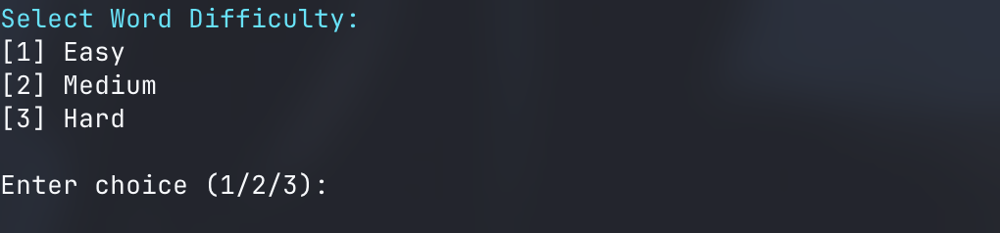
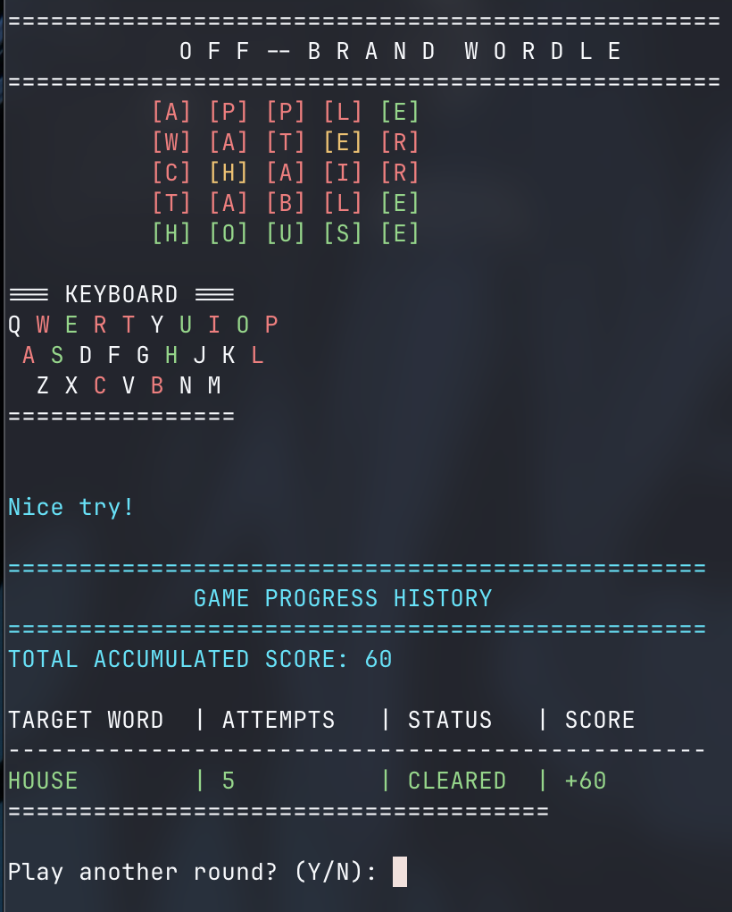
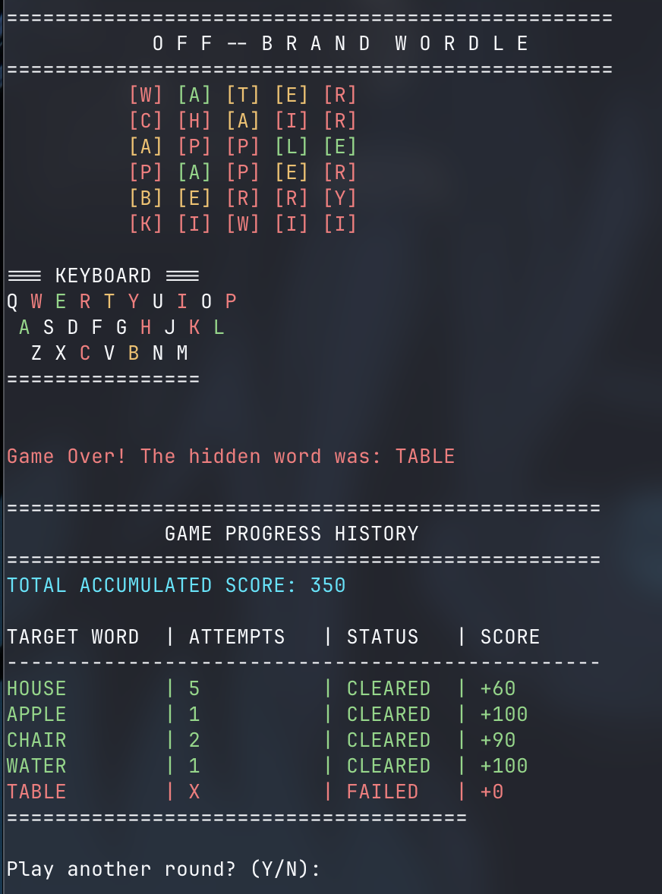
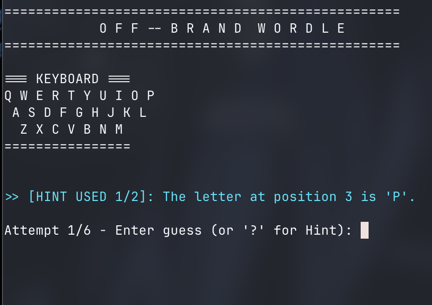

# 🟩 Off Brand Wordle : An attempt to copy the NY Times Greatest Game

It is built using strictly enforced **Object-Oriented Programming (OOP)** standards, including Dependency Injection, etc. You may ask why? Because our teacher told us to :)

---

## ✨ Key Features
* **Difficulty Levels (Bonus):** Why miss some bonus points? Levels are : Easy, Medium, and Hard tiers.
* **Progress Tracking For Scores (Bonus):** Again, why miss bonus points?? Track your scores across various games.
* **Visual Jazz** Colorfull and slighty wonky keyboard visual with colors to show you that it was indeed copied from wordle.
* **Hints:** 2 Hints per word, because how much more help do you need for a 5 letter word??
* **Attempt Based Comments:** Copied the exact table from the assignment :')
* **Custom Exception Handling** Custom exception handling (`InvalidGuessException`) because that all i remember from my class today.

---

## 🏗️ Folder Structure

The application strictly adheres to the one file does one work, aka **Single Responsibility Principle**. 

```text
wordle/
│
├── Program.cs                         # Main Program
├── wordle.csproj
│
├── Exceptions/
│   └── InvalidGuessException.cs       # Custom error handling
│
├── Models/
│   ├── Level.cs                       # Levels (Bonus)
│   └── GameResult.cs                  
│
├── Interfaces/                        # The Interface
│   ├── IWordProvider.cs
│   ├── IGuessValidator.cs
│   ├── IFeedbackGenerator.cs
│   ├── IHintManager.cs
│   ├── ISessionHistory.cs
│   └── IPraiseProvider.cs
│
├── Services/                          # The Implementations (Business Logic)
│   ├── WordProvider.cs
│   ├── GuessValidator.cs
│   ├── FeedbackGenerator.cs
│   ├── HintManager.cs
│   ├── SessionHistory.cs
│   ├── PraiseProvider.cs
│   └── KeyboardTracker.cs             # For that fancy and crooked keyboard design
│
└── Core/
    └── GameEngine.cs                  # The Game 
```

---

## If you want to play the off-brand wordle

1. Clone the repository to your local machine.
2. Navigate to the root directory containing the `.csproj` file.
3. Run the command :
   ```bash
   dotnet run 
   ```

---

## My game, My Rules
1. Guess a 5 letter word
2. You get **6 attempts**, take it or leave it.
3. After each guess, the terminal will colorize your letters:
   * **Green:** The letter is in the word and in the correct spot.
   * **Yellow:** The letter is in the word, but in the wrong spot.
   * **Red:** The letter is not in the word.
4. Type `?` instead of a guess to use a Hint (Max 2 per round).

---

## 🖥️ Output Gallery (Application States)

### 1. Level Selection




### 2. Active Gameplay
*Note: It actually looks better when you play it :)*




### 3. Hint System

